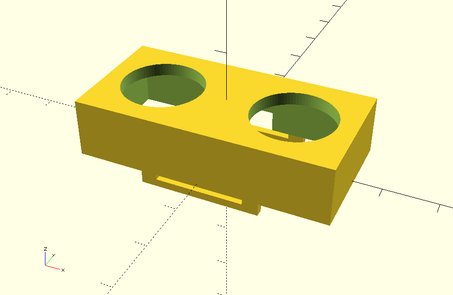

-- TankMon

A no frills dual tank water level monitoring solution incorporating:

- ESP8266 low power ultrasonic measurer remote monitor and reporter device for dual tank setups [tankmon-probedual] 
Open this in Arduino, ensure that ESP8266 is installed as per the [Adafruit esp8266 arduino guide](https://learn.adafruit.com/adafruit-io-basics-esp8266-arduino/using-arduino-ide)

- PHP server receiver and graph display tool [tankmon]

- OpenSCAD construction for Ultrasonic case and ESP8266/NODEMCU case [tankmon-cases]

- Circuit Design and construction for remote monitor circuit and board pcb in KiCAD [tankmon-pcb]

A demonstration exercise in, simplifying workflows and modularity, utilising Arduino, NodeMCU, KiCAD, OpenSCAD.
