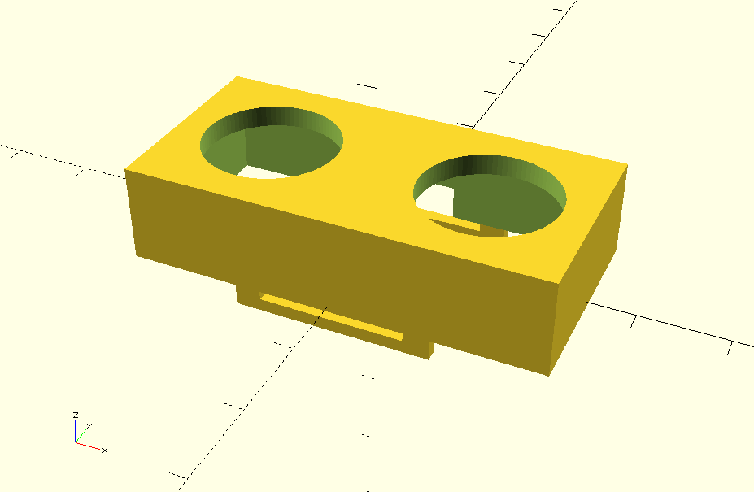

- OpenSCAD case function designs for Make-A-Bracket and Tank fitment for Make-A-Bracket

Function call for make a bracket makes quick development of cases possible, use the following:
use <mab_case_func.scad>

Which simplifies the cases for both the Ultrasonic sensor and the NodeMCU and wiring board.

Work smarter, not harder!

The files us_case and us_case_plug correspond to cases using the above functions for case construction and plug/cap construction.

